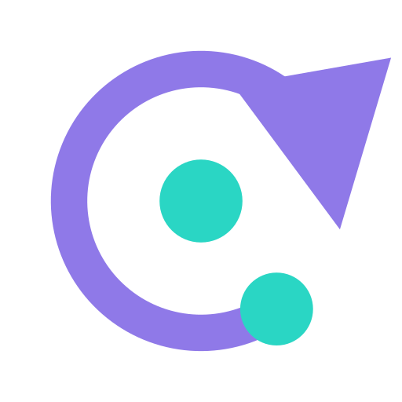

<h2 align="center">
  <br/>
  Every Node. Every Edge. Every Loop. Traced.
</h2>

<p align="center">
  <a href="LICENSE">
    
  </a>
  <a href="#getting-started">
    
  </a>
  
</p>

Orkes Watcher is an observability platform for graph-based agents. It doesn't run your
graph and it doesn't wrap your logic in a new framework — it just answers, for any run,
exactly what happened: which nodes executed, which edges were traversed, how many times a
loop re-entered, and what the state looked like at every step. Point an instrumented graph
at a project's ingest endpoint, and every run becomes an inspectable, live-updating trace.

## Getting Started

The platform itself (dashboard + ingest API) runs with one command via Docker Compose —
no separate frontend/backend setup required.

```bash
git clone <this-repo>
cd orkes-watcher
cp .env.example .env
docker compose up -d --build
```

Open `http://localhost:8080`, sign in with the bootstrap admin
(`admin@orkes.local` / `changeme` by default — see `.env.example`), and create a project
to get an ingest API key.

<details><summary>No traces to look at yet? Seed a demo project with realistic example runs.</summary>

```bash
docker compose exec backend python -m scripts.seed_example_traces
```

Populates a `support-triage` project with a few real scenarios — a happy path with a
parallel branch, a loop that retries and escalates, and a quick simple success — sent
through the actual ingest endpoint, not written to the database directly.
</details>

<details><summary>Here's the shape of tracing a graph once the SDK ships (proposed API — not published yet)</summary>

```python
from orkes_watcher import tracer

tracer.init(api_key="ok_live_...")

with tracer.trace("support-triage") as run:
    with run.node("classify", "Classify intent"):
        with run.edge("e1", "classify", "retrieve", edge_type="conditional") as edge:
            with edge.fn_call("classify_intent") as call:
                call.set_args({"text": user_input})
                intent = classify_intent(user_input)
                call.set_returns({"intent": intent})

    with run.node("retrieve", "Retrieve context"):
        ...
    # the `with tracer.trace(...)` block finalizing cleanly marks the run "finished";
    # an exception inside it marks it "failed" and still propagates to your code
```
</details>

## Core concepts

- **Project** — an ingest namespace (e.g. one per app or environment: production, staging,
  local). Traces sent with a project's API key land in that project.
- **Run / trace** — one execution of a graph. Identified by a run ID, with a status
  (finished, failed, running), an elapsed time, and a full record of node and edge
  traversals.
- **Graph** — the node/edge structure a run traversed: entry (`START`) and terminal (`END`)
  nodes, branches, parallel splits, and loops that can re-enter a node multiple times before
  exiting.
- **Trace inspector** — a visual graph view of a single run, where selecting a node or edge
  shows its metadata, state snapshot, and any function calls traced on that step.
- **API keys** — scoped to one project, with an ingest or read-only scope; used to
  authenticate traces sent to the platform.
- **Access / roles** — Admin, Developer, and Viewer roles control who can create projects,
  manage keys, and view traces, with per-project grants for non-admins.

## Features

- **Live trace inspector** — a graph view of a run that updates node-by-node while it's
  still executing, not just after it finishes.
- **Dashboard aggregates** — runs by outcome, slowest nodes, p95 elapsed time, edge
  traversal and loop counts per project.
- **Project-scoped API keys** — ingest or read-only, hashed at rest, shown once at
  creation.
- **Role-based access** — Admin / Developer / Viewer, with per-project membership grants
  and an invite-and-activate flow for new accounts.
- **Per-project retention & sampling** — cap how long traces are kept and drop a
  configurable share of successful (never failed) runs before they're persisted.
- **Single-command deploy** — one `docker compose up`, with the frontend's API origin
  configured at container start, not baked in at build time.

## Roadmap

| Feature | Description | Status |
|---|---|---|
| Dashboard, trace inspector, RBAC, API keys | Core observability platform | Implemented |
| Docker Compose deployment | Runtime-configurable, single-command self-hosted deploy | Implemented |
| Python SDK | Manual instrumentation API (`tracer.trace`/`node`/`edge`) for any graph-based agent | Planned |
| Live view reconnect | Automatic reconnect/backoff for the live trace WebSocket | Planned |
| Horizontal scaling | Redis-backed live fan-out across more than one backend instance | Future |
| Remote control (duplex) | Bidirectional channel to pause/resume/kill a running agent from the dashboard | Future |

## Documentation

Backend setup, structure, migrations, and maintenance scripts:
[`backend/README.md`](backend/README.md).

## Contributing

Contributions are welcome! Please see the [Contributing Guide](CONTRIBUTING.md).

## License

Orkes Watcher is licensed under the [MIT License](LICENSE).
